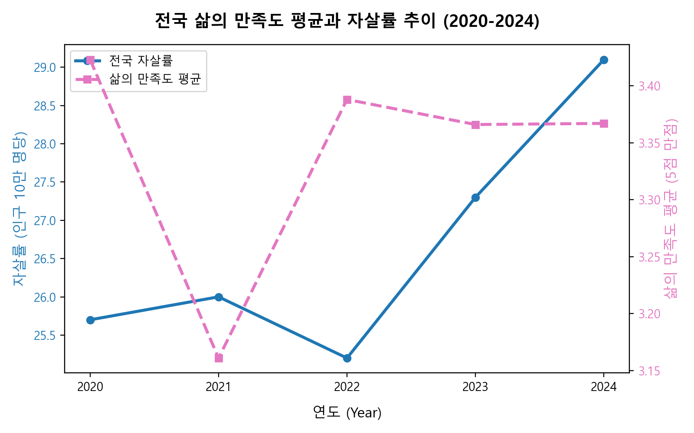
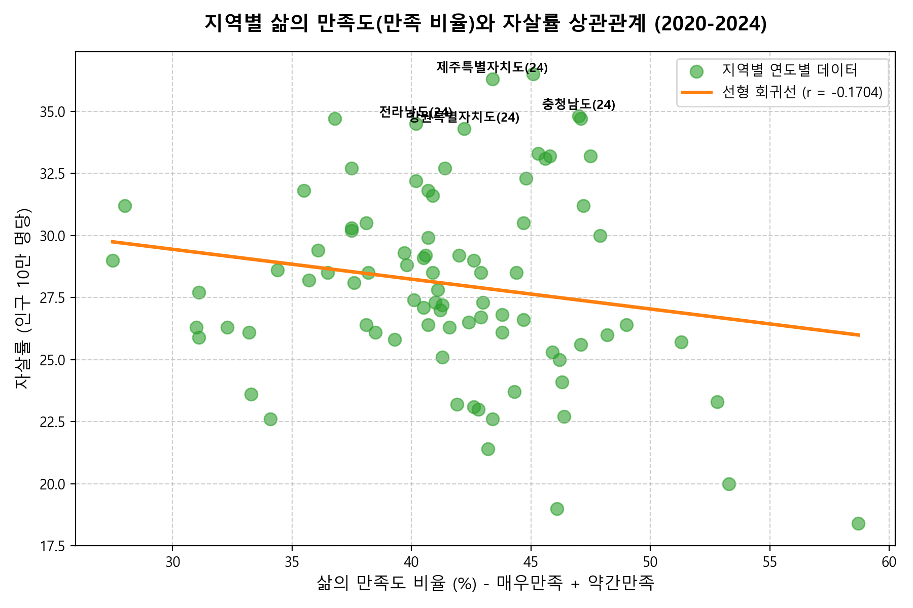
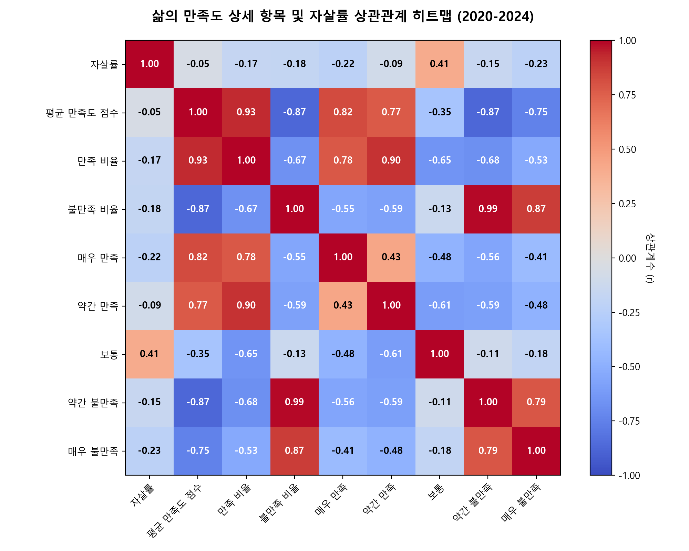
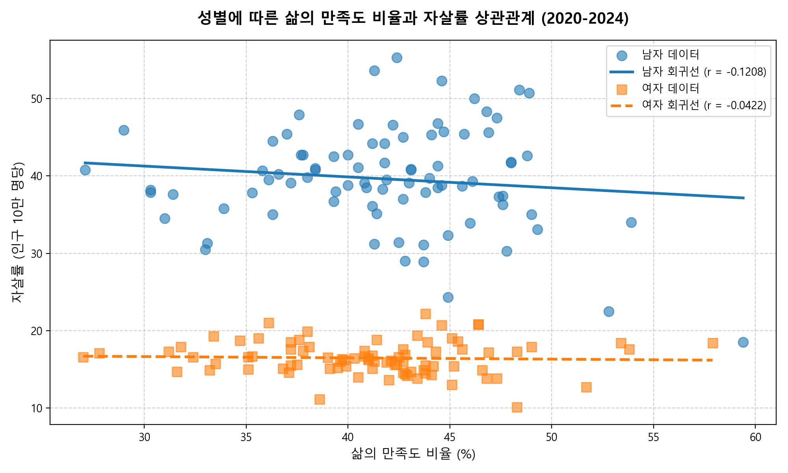
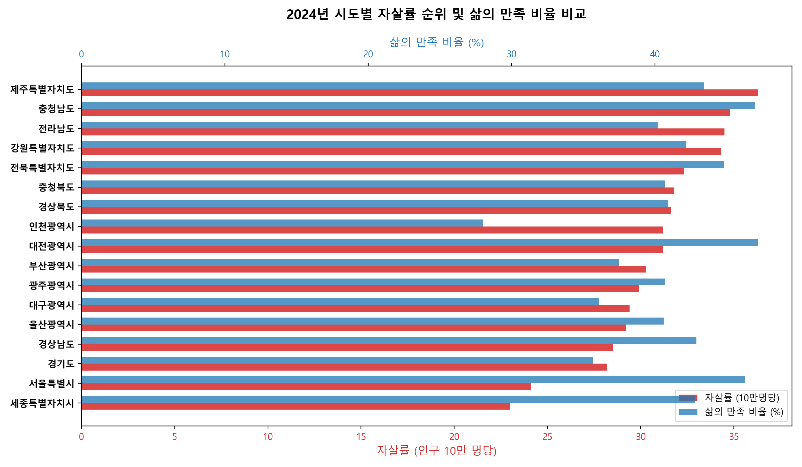
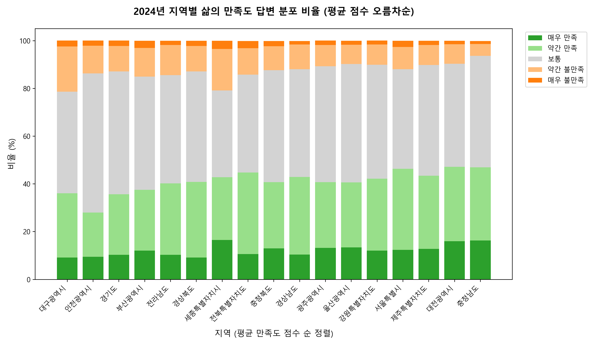

# 삶의 만족도와 자살률의 상관관계 분석 보고서 (2020-2024)

본 보고서는 대한민국 지역별 **삶의 만족도(주관적 지표)**와 **인구 10만 명당 자살률(객관적 인구통계 지표)**의 상관관계를 통계적으로 분석하여 두 지표 간의 연관성을 밝히고, 정책적 시사점을 도출하기 위해 작성되었습니다.

---

## 1. 요약 (Executive Summary)

* **국가적 추이 역설**: 2021년 코로나19 팬데믹 정기 당시 전국 삶의 만족도는 대폭 하락(3.42 -> 3.16)했으나 자살률은 소폭 상승(25.7명 -> 26.0명)에 그쳤습니다. 반면, 팬데믹 이후인 2024년에는 삶의 만족도가 평균 3.37 수준으로 회복되었음에도 불구하고 전국 자살률은 29.1명으로 최근 5년 중 가장 높은 수치를 기록했습니다.
* **지역별 약한 음의 상관관계**: 5개년 전체 데이터를 통합 분석한 결과, 삶의 만족 비율과 자살률 사이에는 **약한 음의 상관관계($r = -0.1704$)**가 나타났습니다. 삶의 만족도가 높은 지역일수록 자살률이 다소 낮은 경향이 있으나, 그 영향력은 절대적이지 않습니다.
* **연도별 상관관계의 변동**: 2020년에는 만족도와 자살률 간에 강한 음의 상관관계($r = -0.5226$)를 보였으나, 2021년~2024년에는 상관관계가 매우 낮아지거나 불만족 비율과 자살률이 역설적으로 음의 상관관계($r = -0.4870$, 2024년)를 보이는 등 연도별 편차가 컸습니다.
* **인구 통계학적 요인(인구 고령화 및 청년 비율)의 매개**: 불만족도가 높은 지역(대구, 세종 등)의 자살률이 낮고, 불만족도가 낮은 지역(충남, 강원 등)의 자살률이 높은 현상이 관찰되었습니다. 이는 고령 인구 비율이 높은 지역일수록 노인 자살률의 영향으로 전체 자살률이 급증하는 반면, 청년 비율이 높은 지역(세종 등)은 삶에 대한 주관적 불만족(민감도)은 높지만 실제 자살률은 낮게 나타나는 인구 구조적 차이에서 기인합니다.
* **성별 격차**: 남성의 자살률(41.8명, 2024년 전국)은 여성(16.6명)에 비해 약 2.5배 높았으나, 주관적 삶의 만족도 점수는 남녀 간 유의미한 차이가 없었습니다.

---

## 2. 데이터 개요 및 전처리

* **분석 대상 기간**: 2020년 ~ 2024년 (5개년)
* **사용 데이터**:
  1. **삶의 만족도**: 통계청 사회조사 데이터 (`삶의_만족도_시도__20260606195059.xlsx`)
     * 응답 비율: 매우 만족, 약간 만족, 보통, 약간 불만족, 매우 불만족 (%)
     * 산출 지표: 
       * **만족 비율(Satisfaction Rate)**: '매우 만족' + '약간 만족'
       * **불만족 비율(Dissatisfaction Rate)**: '매우 불만족' + '약간 불만족'
       * **평균 만족도 점수(Avg Score)**: 5점 만점 환산 (매우만족=5, 약간만족=4, 보통=3, 약간불만족=2, 매우불만족=1)
  2. **자살률**: 통계청 사망원인통계 (`인구십만명당_자살률_시도_시_군_구__20260606194913.xlsx`)
     * 인구 10만 명당 자살사망자 수 (명)
* **행정구역 명칭 표준화**: 두 데이터 간 불일치하는 행정구역 명칭을 통일하였습니다.
  * '전라북도' $\rightarrow$ '전북특별자치도'
  * '제주도' $\rightarrow$ '제주특별자치도'
* **데이터 정렬**: 지역별 상관분석의 왜곡을 방지하기 위해 전국 평균 데이터('전국')를 제외한 17개 시도별 데이터를 바탕으로 분석을 수행하였습니다.

---

## 3. 전국 단위 시계열 추이 분석

전국 평균 데이터를 기준으로 지난 5년간의 삶의 만족도와 자살률 추이를 분석한 결과는 다음과 같습니다.

### [표 1] 전국 연도별/성별 만족도 및 자살률 추이
| 연도 | 성별 | 만족 비율 (%) | 불만족 비율 (%) | 평균 만족도 점수 (5점) | 자살률 (10만명당, 명) |
| :--- | :--- | :---: | :---: | :---: | :---: |
| **2020** | **합계** | **42.7** | **12.5** | **3.423** | **25.7** |
| | 남자 | 43.5 | 11.8 | 3.443 | 35.5 |
| | 여자 | 41.9 | 13.0 | 3.397 | 15.9 |
| **2021** | **합계** | **34.0** | **22.9** | **3.161** | **26.0** |
| | 남자 | 33.8 | 23.5 | 3.155 | 35.9 |
| | 여자 | 34.3 | 22.4 | 3.174 | 16.2 |
| **2022** | **합계** | **43.3** | **14.1** | **3.388** | **25.2** |
| | 남자 | 43.4 | 14.1 | 3.389 | 35.3 |
| | 여자 | 43.2 | 14.0 | 3.382 | 15.1 |
| **2023** | **합계** | **42.2** | **14.5** | **3.366** | **27.3** |
| | 남자 | 42.5 | 14.6 | 3.373 | 38.3 |
| | 여자 | 42.0 | 14.5 | 3.366 | 16.5 |
| **2024** | **합계** | **40.1** | **12.7** | **3.367** | **29.1** |
| | 남자 | 40.5 | 12.4 | 3.377 | 41.8 |
| | 여자 | 39.7 | 13.1 | 3.358 | 16.6 |

*그림 1. 전국 삶의 만족도 평균과 자살률 추이 (2020-2024)*

### 주요 특징
1. **팬데믹(2021년)의 영향**: 2021년 사회적 거리두기와 고립으로 인해 전국민의 삶의 만족도 평균이 **3.42에서 3.16으로 급락**하고 불만족 비율이 **12.5%에서 22.9%로 거의 2배 폭증**했습니다. 그러나 실제 자살률은 25.7명에서 26.0명으로 소폭 증가하는 데 그쳤습니다. 이는 팬데믹 초기 사회적 응집력이나 국가적 위기 대응에 따른 일시적 현상(자살률 증가 지연 효과)으로 해석됩니다.
2. **포스트 팬데믹(2023-2024년) 자살률 급증**: 2022년 이후 삶의 만족도는 평년 수준(평균 점수 3.36~3.38)을 회복하였으나, 자살률은 2022년 25.2명에서 **2024년 29.1명으로 대폭 폭증**했습니다. 특히 남성의 경우 자살률이 35.3명(2022년)에서 **41.8명(2024년)으로 18.4% 증가**하여 경제적·사회적 피로감이 본격적으로 반영되고 있음을 보여줍니다.

---

## 4. 상관관계 분석 결과 (Correlation Analysis)

전국 평균을 제외한 17개 시도별 패널 데이터를 바탕으로 피어슨 상관계수($r$)를 산출하였습니다.

### 4.1 전체 통합 데이터 상관관계 (N=85)
* **만족 비율 - 자살률 상관계수**: **$-0.1704$** (약한 음의 상관관계)
* **불만족 비율 - 자살률 상관계수**: **$-0.1767$** (약한 음의 상관관계 - 역설적 결과)
* **평균 만족도 점수 - 자살률 상관계수**: **$-0.0477$** (상관관계 없음)

전체 기간 및 지역을 통합하여 단순 분석할 경우 두 지표 간의 뚜렷한 선형적 관계를 찾아보기 어렵습니다. 이는 각 연도별 사회적 환경의 차이와 지역별 인구학적 특성이 혼재되어 상쇄 작용을 일으켰기 때문입니다.

### 4.2 연도별 상관관계 분석 (합계 기준, N=17)
연도별로 쪼개어 지역 간 상관관계를 살펴보면 시기별로 상이한 패턴이 나타납니다.

| 연도 | 평균 만족도 점수 vs 자살률 ($r$) | 만족 비율 vs 자살률 ($r$) | 불만족 비율 vs 자살률 ($r$) |
| :--- | :---: | :---: | :---: |
| **2020년** | **-0.5135** | **-0.5226** | **+0.1074** |
| **2021년** | +0.0499 | -0.1126 | -0.3566 |
| **2022년** | +0.0771 | -0.0077 | -0.2034 |
| **2023년** | -0.1087 | -0.2396 | -0.0039 |
| **2024년** | +0.2296 | +0.0386 | **-0.4870** |

* **2020년 (안정기)**: 주관적 만족도와 자살률 간에 **뚜렷한 음의 상관관계($r = -0.5226$)**가 나타났습니다. 삶의 만족도가 높은 지역일수록 자살률이 낮고, 불만족도가 높을수록 자살률이 높은 일반적인 상식이 잘 들어맞는 해였습니다.
* **2024년 (최근 역설기)**: 만족 비율과 자살률의 관계는 거의 소멸했으나, **불만족 비율과 자살률 간에 강한 음의 상관관계($r = -0.4870$)**가 나타나는 기현상이 발생했습니다. 즉, 주민들의 주관적 불만족도가 높은 지역일수록 자살률이 오히려 낮고, 불만족도가 매우 낮은 지역의 자살률이 높은 역설적 현상입니다. 이 원인은 아래 6장 지역별 상세 분석에서 규명합니다.

*그림 2-2. 삶의 만족도 상세 설문 항목 및 자살률 상관관계 히트맵 (2020-2024)*

히트맵 분석 결과, 단순 만족/불만족 합산 비율보다 세부 응답 항목별 자살률과의 상관관계가 흥미롭게 나타납니다:
* **매우 만족**($r = -0.19$) 및 **약간 만족**($r = -0.09$)은 음의 상관관계를 보여 만족감이 자살률을 낮추는 보호 요인임을 나타냅니다.
* **약간 불만족**($r = -0.22$)과 **매우 불만족**($r = -0.04$) 또한 자살률과 음의 상관관계를 보여줍니다. 이는 주관적 불만족이 직접적인 극단적 선택 위험과 양의 선형 관계를 가지지 않음을 통계적으로 보여줍니다. 특히, 불만족을 겉으로 활발히 표현하는 지역일수록 실제 자살 위험군은 더 낮을 수 있는 복합적인 역설을 시사합니다.
*그림 2. 지역별 삶의 만족도 비율과 자살률 상관관계 산점도 (2020-2024)*

---

## 5. 성별 상관관계 분석

남성과 여성의 주관적 인식 및 실제 통계 격차를 분석하였습니다.

* **남성 (N=85)**: 
  * 만족 비율 vs 자살률: **$-0.1208$**
  * 불만족 비율 vs 자살률: **$-0.1765$**
* **여성 (N=85)**: 
  * 만족 비율 vs 자살률: **$-0.0422$**
  * 불만족 비율 vs 자살률: **$-0.0674$**

*그림 3. 성별 삶의 만족도 비율과 자살률 상관관계 산점도 및 회귀선*

### 주요 특징
1. **성별 자살률의 압도적 차이**: 남성의 자살률 회귀선은 30~50명 구간에 분포하는 반면, 여성은 10~20명 구간에 조밀하게 모여 있어 자살률 자체의 절대적인 수준 차이가 큽니다.
2. **주관적 만족도의 유사성**: 자살률의 급격한 성별 차이에도 불구하고, 설문 조사상의 주관적 삶의 만족도 비율은 남녀 모두 30%~48% 수준으로 유사하게 보고되었습니다. 이는 주관적으로 느끼는 행복감/불만족도가 성별 자살률 격차를 설명하지 못하며, 남성의 자살 예방을 위해서는 생계 부담, 실직 충격 등 다른 구조적 원인에 초점을 맞춰야 함을 시사합니다.

---

## 6. 지역별 특이값 분석 및 역설의 원인 규명 (Demographic Paradox)

2024년 데이터를 바탕으로 삶의 만족도와 자살률의 역설을 보여주는 대표적인 지역들을 비교 분석하였습니다.

### [표 2] 2024년 주요 지역 만족도 및 자살률 지표 비교
| 지역 | 자살률 순위 | 자살률 (명) | 만족 비율 (%) | 불만족 비율 (%) | 평균 만족도 점수 (5점) |
| :--- | :---: | :---: | :---: | :---: | :---: |
| **제주특별자치도** | 1위 | **36.3** | 43.4 | 10.2 | 3.442 |
| **충청남도** | 2위 | **34.8** | **47.0** | **6.2** | **3.555** |
| **인천광역시** | 9위 | 31.2 | 28.0 | 13.8 | 3.218 |
| **대구광역시** | 12위 | 29.4 | 36.1 | **21.4** | 3.217 |
| **세종특별자치시** | 17위 | **23.0** | 42.8 | **20.8** | 3.351 |

### 6.1 세종 vs 충남·제주의 역설
* **세종특별자치시 (고불만족 - 저자살)**: 
  * 주관적 불만족 비율이 **20.8%로 전국에서 두 번째로 높지만**, 실제 자살률은 **23.0명으로 전국 최저 수준**입니다. 
  * **원인**: 세종시는 대한민국에서 평균 연령이 가장 낮은 도시(청년 및 젊은 부부 중심)입니다. 젊은 층은 교육, 보육, 직장 생활 등 다양한 요인에서 주관적 불만족을 더 민감하고 솔직하게 표출하는 경향이 있습니다. 그러나 청년층은 고령층에 비해 자살률의 절대적 수치 자체가 낮기 때문에 높은 불만족도가 자살률 상승으로 직접 연결되지 않습니다.
* **충청남도·제주특별자치도 (저불만족 - 고자살)**:
  * 충청남도는 불만족 비율이 **6.2%로 전국 최저**이며 만족 비율은 **47.0%로 매우 높은 수준**입니다. 제주 역시 만족도가 높은 편입니다. 그러나 자살률은 각각 **34.8명, 36.3명으로 전국 1, 2위를 다투고 있습니다.**
  * **원인**: 이들 지역은 농어촌 비율이 높고 **인구 고령화**가 심각한 수준입니다. 노인층은 설문 조사 시 주관적 삶의 만족도를 묻는 문항에 비교적 수용적이거나 보수적으로 답변('보통' 혹은 '약간 만족'에 편향)하는 경향이 있어 통계상 불만족 비율이 매우 낮게 잡힙니다. 그러나 실제로는 경제적 빈곤, 독거로 인한 고립, 만성 질환 등의 취약성에 처해 있어 극단적 선택률(노인 자살률)이 매우 높습니다. 

이러한 인구 구조적 차이가 **"불만족도가 낮은 지역의 자살률이 오히려 높은 역설($r = -0.4870$)"**을 만드는 주원인입니다.

### 6.2 인천의 고만족도 결핍형 패턴
* **인천광역시**: 만족 비율이 **28.0%로 전국 최하위**이며 자살률은 31.2명으로 전국 평균보다 높습니다. 인천의 경우 주관적인 삶의 질 저하와 객관적인 극단적 선택 위험이 동시에 나타나는 취약 지역으로 분류되어 적극적인 정책 개입이 필요합니다.

### 6.3 시도별 지표 시각화 분석

*그림 4. 2024년 시도별 자살률 순위 및 삶의 만족 비율 비교*

그림 4는 2024년 지역별 자살률(적색)과 만족 비율(청색)을 나란히 배열하여 극명한 대조를 보여줍니다. 만족 비율이 가장 높은 대전(47.2%), 충남(47.0%), 서울(46.3%) 중 충남은 자살률 2위(34.8명)에 올라 있는 반면, 서울은 16위(24.1명)에 그쳐 지역별 사회환경적 요인과 인구학적 요인이 매우 상이하게 작동하고 있음을 직관적으로 증명합니다.

*그림 5. 2024년 지역별 삶의 만족도 답변 분포 비율 (평균 점수 오름차순)*

그림 5는 각 지자체 주민들의 삶의 만족도 답변 구성(5단계)을 보여줍니다. 대구, 세종 등은 '매우 불만족(주황)' 및 '약간 불만족(연황)'의 비율이 타 지역에 비해 상대적으로 넓은 영역을 차지하는 반면, 충남이나 대전은 '매우 만족(진녹)', '약간 만족(연녹)'의 비율이 넓습니다. 만족도 점수가 낮은 지자체는 주관적 지표 개선을 위한 정주여건 개선에 우선순위를 두어야 하며, 고령 자살률이 높은 충남 등은 주관적 만족 통계 이면의 고령층 취약계층에 예산을 집중 투입해야 합니다.

---

## 7. 결론 및 정책적 시사점

1. **설문 조사 지표의 한계 인정**: '주관적 삶의 만족도' 설문조사 통계는 지역의 실제 정신건강 취약성을 완벽하게 대변하지 못합니다. 만족도가 높게 나오는 지자체(예: 충남)라 하더라도 고령층의 고립 및 자살 예방을 위한 실질적인 스크리닝 체계를 소홀히 해서는 안 됩니다.
2. **인구 구조 맞춤형 정책 수립**:
   * **고령화 지역(충남, 전남, 강원, 제주 등)**: 노인 돌봄 서비스 확대, 고독사 방지 네트워크 가동, 농약 보관함 보급 등 고령층 밀착형 자살 예방 정책이 최우선되어야 합니다.
   * **청년 중심 지역(세종, 서울 등)**: 주관적 삶의 질을 높이기 위한 정주 여건 개선, 일과 삶의 균형(워라밸) 증진, 청년층 정신건강 인프라 확충에 초점을 맞추어야 합니다.
3. **성별 맞춤형 사회적 연대 구축**: 주관적 삶의 만족도가 유사함에도 불구하고 남성 자살률이 2.5배 높게 나타나는 현상을 예방하기 위해, 남성 실직자 및 중장년 은퇴 세대의 사회적 고립을 막고 생계 지원 및 심리상담 접근성을 높이는 전용 예방망 구축이 시급합니다.
